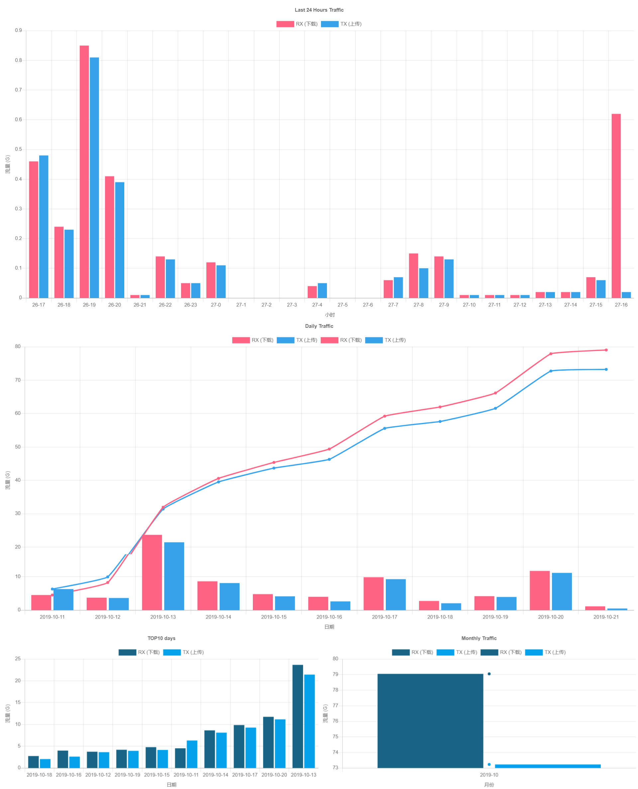

### VNSTAT-DASHBOARD
> A simple H5 DashBoard for vnstat which using `chart.js`  
#### ScreenShot

#### How to Use ?
> For normal use, you must make sure that vnstat had collected enough data.  

[中文文档](https://iitii.github.io)

1. Check if you have these: `git`, `node.js`, `vnstat`, `Web Server`
2. Clone this repo: `git clone https://github.com/IITII/VNSTAT-DASHBOARD`
3. run `vnstat.sh` to generate `vnstat.json` at `public/chartjs/` : `bash vnstat.sh`
4. run `index.js` to generate `*.json` at `public/chart/`
5. Use Web server to serve **`public` folder**, then visit the corresponding URL
6. Enjoy it!

#### Modify
* For most commonly used modifications, I had wrote them to `config.json`
* Modify the `config.json` with the [README](https://github.com/IITII/SimpleLineChart) of ***SimpleLineChart***.